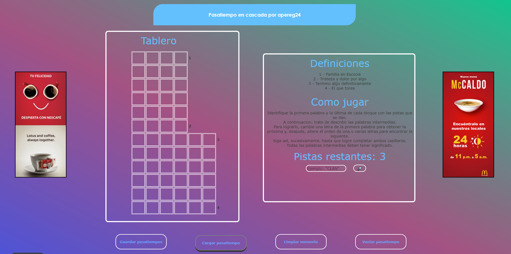
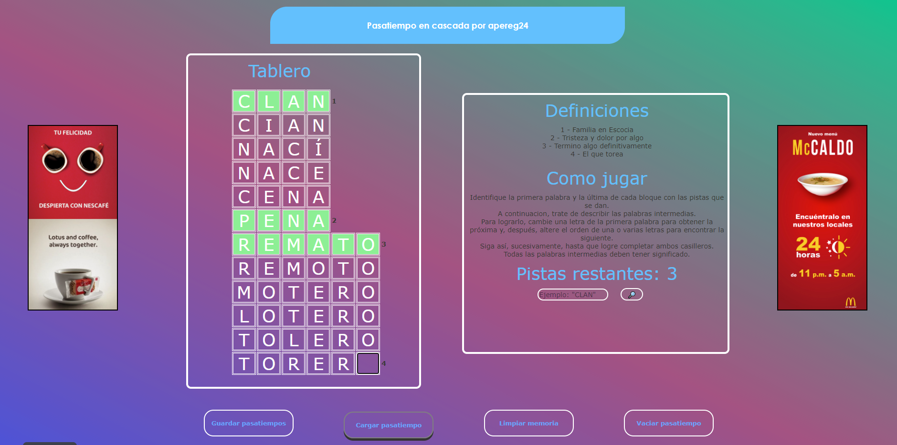
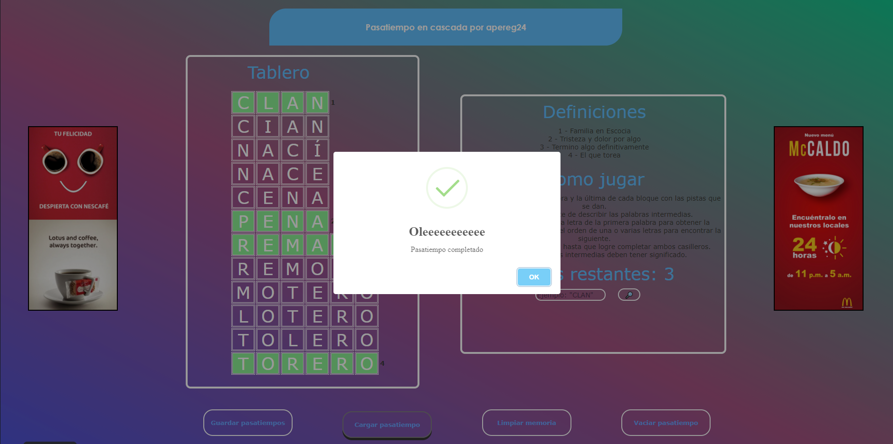
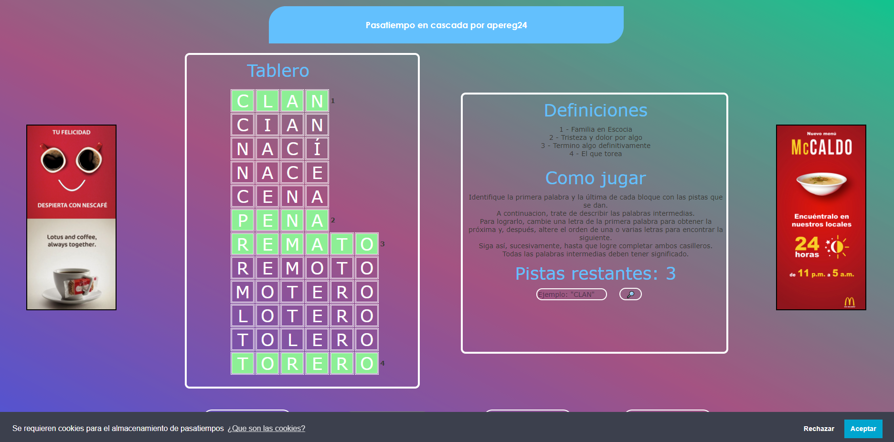
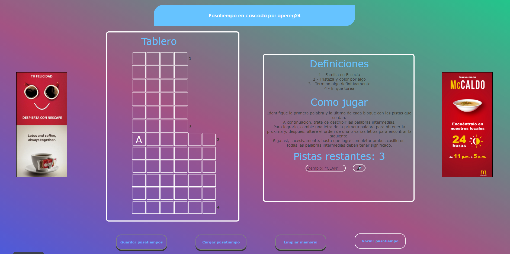
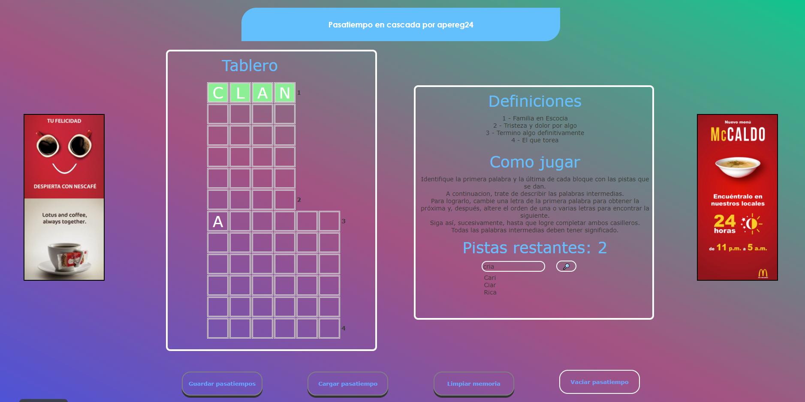

# PasatiempoEnCascada
Primera práctica de la asignatura de Aplicaciones Web entregada el 03/05/2021

## Requerimientos:
La página web deberá permitir:

-   Mostrar de  forma completa, con el tablero, las pistas y  la descripción,  un pasatiempo En Cascada. Puede ser el que se ofrece u otro seleccionado por el alumno.

-   Permitir al usuario resolver en  la propia página web el pasatiempo. En cada casilla sólo podrá ir una letra.

-   La página web cargará asíncronamente un diccionario (petición CORS) de palabras desde https://ordenalfabetix.unileon.es/aw/diccionario.txt. que residirá en el servidor, y comprobará que todas las palabras que el usuario vaya completando existen en el diccionario.  Si no es así lo  avisará mediante una alerta.

-   Si el usuario permite almacenamiento local (cookies) se podrá guardar una resolución parcial para ser recuperada posteriormente. Para ello se identificará de  forma única el pasatiempo y se usará algún mecanismo  de almacenamiento local. Si el usuario lo desea se borrará ese almacenamiento para  dejar limpio el pasatiempo.

-   La página podrá dar hasta tres pistas como ayuda  a la resolución del pasatiempo. Cada pista consistirá en  que el usuario  pone  una  serie de letras y la página le da una  lista con las palabras que existen en el diccionario que contienen exactamente esas letras.

## Resultado gráfico

### Web por defecto

### Pasatiempo resuelto

### Solicitud de cookies

### Cookies rechazadas

### Ejemplo de pista

